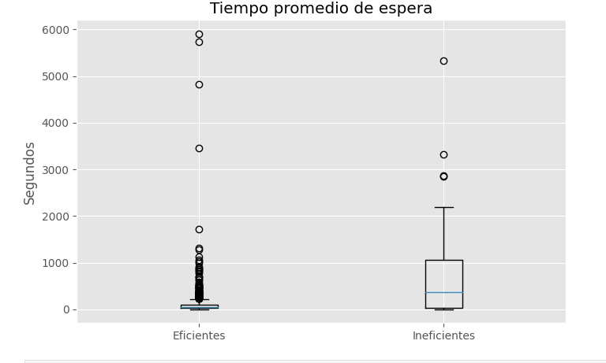
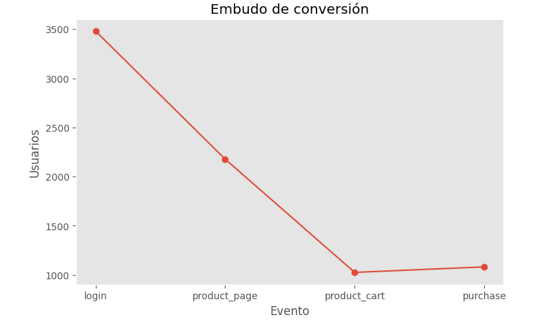

# Sara Camacho E.

¡Hola! Soy médica con formación en epidemiología y análisis de datos. Bienvenido/a a mi portafolio de proyectos.

[LinkedIn](https://www.linkedin.com/in/sara-camacho-es/) · [GitHub](https://github.com/Sara-MST)

---

## Acerca de mí

Médica con diplomado en epidemiología y formación certificada en análisis de datos (Python, SQL, estadística aplicada). Combino el pensamiento clínico y epidemiológico —lectura crítica de evidencia, diseño de estudios, comprensión de terminología médica y regulatoria— con herramientas de analítica moderna para convertir datos complejos en decisiones de negocio.

Me interesa aportar esta doble mirada (salud + datos) a equipos de **real-world evidence, market access, asuntos médicos, farmacovigilancia o business analytics** en la industria farmacéutica y de salud, aunque mi perfil también encaja en cualquier equipo que necesite traducir datos en decisiones.

### Habilidades técnicas

`Python` `Pandas` `NumPy` `Matplotlib` `Seaborn` `SciPy` `Statsmodels` `SQL` `SQLAlchemy` `Excel`

- Limpieza, transformación y análisis exploratorio de datos (EDA)
- Pruebas de hipótesis: t-test, Mann-Whitney, Shapiro-Wilk, corrección de Bonferroni
- Diseño y análisis de experimentos A/B
- Consultas SQL con joins múltiples, agregaciones y subconsultas

### Habilidades de dominio (mi diferencial)

- Formación médica y epidemiológica: diseño de estudios, causalidad, lectura crítica de evidencia
- Comprensión de terminología clínica y regulatoria
- Capacidad de traducir hallazgos técnicos en recomendaciones claras para audiencias no técnicas

---

## Proyectos protagonistas

## 1. Identificación de operadores ineficientes en un centro de contacto

Un centro de contacto necesitaba identificar de forma objetiva qué operadores tenían un desempeño por debajo del estándar, para priorizar acciones de mejora. Este tipo de análisis es directamente aplicable a **líneas de atención al paciente, programas de adherencia terapéutica o farmacovigilancia**, donde la calidad de la atención telefónica impacta directamente los resultados en salud.

`Python` `Pandas` `SciPy (Shapiro-Wilk, Mann-Whitney)` `Seaborn` `Pruebas de hipótesis`

<!-- Sube tu captura del boxplot de tiempos de espera y descomenta esta línea: -->
<!--  -->

**Metodología:** limpieza de 53,902 registros de llamadas de 45,730 operadores (ago–nov 2019); construcción de indicadores por operador (tasa de llamadas perdidas, tiempo promedio de espera, duración promedio); prueba de normalidad (Shapiro-Wilk) y prueba no paramétrica (Mann-Whitney) para comparar tiempos de espera entre operadores eficientes e ineficaces.

**Resultado:** se desarrolló una metodología objetiva para identificar operadores potencialmente ineficaces, confirmada estadísticamente. Se recomendó un dashboard de monitoreo con alertas automáticas, complementado con indicadores de calidad.

**[Ver código completo →](https://github.com/Sara-MST/analisis-call-center)**

---

## 2. Test A/B de un embudo de conversión

Evaluación de un nuevo sistema de recomendaciones mediante un experimento A/B, analizando el embudo desde el login hasta la compra. El mismo diseño experimental se usa para **medir el impacto de campañas de educación al paciente o cambios en canales digitales de salud**.

`Python` `Pandas` `SciPy` `Statsmodels` `Tests A/B` `Corrección de Bonferroni`

<!-- Sube tu captura del gráfico del embudo y descomenta esta línea: -->
<!--  -->

**Metodología:** verificación de la asignación aleatoria de ~14,500 usuarios; construcción del embudo (login → producto → carrito → compra); pruebas de proporciones con corrección de Bonferroni por comparar 4 eventos simultáneamente.

**Resultado:** la única diferencia significativa entre grupos ocurrió en la etapa de "página de producto"; el nuevo sistema cambia el comportamiento de navegación pero **no aumenta las compras**. Se recomendó no implementar el cambio a escala completa sin evidencia de impacto en conversión final.

**[Ver código completo →](https://github.com/Sara-MST/ab-test-embudo)**

---

## Otros proyectos

- **Segmentación de mercado global — Videojuegos:** análisis de ventas por plataforma, género y región (EE.UU., Europa, Japón); Japón muestra un comportamiento de consumo distinto que justifica estrategias segmentadas por región. `Python` `Pruebas t` — **[Ver código →](https://github.com/Sara-MST/segmentacion-videojuegos)**

- **Análisis SQL — Base de datos de un servicio de lectura:** consultas SQL sobre libros, autores y calificaciones; los usuarios que más califican escriben en promedio menos reseñas de texto de lo esperado. `SQL` `SQLAlchemy` — **[Ver código →](https://github.com/Sara-MST/sql-libros)**
